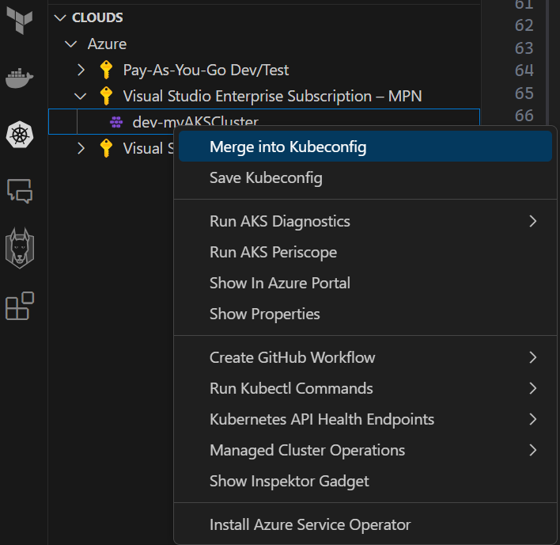
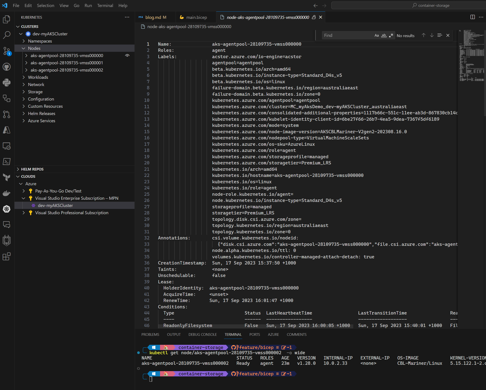
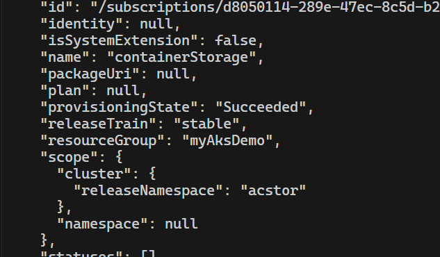
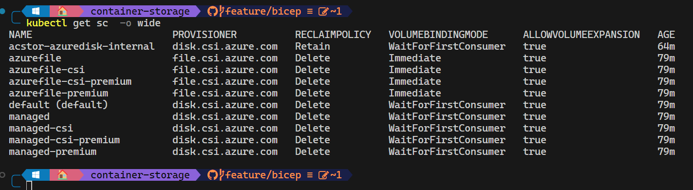
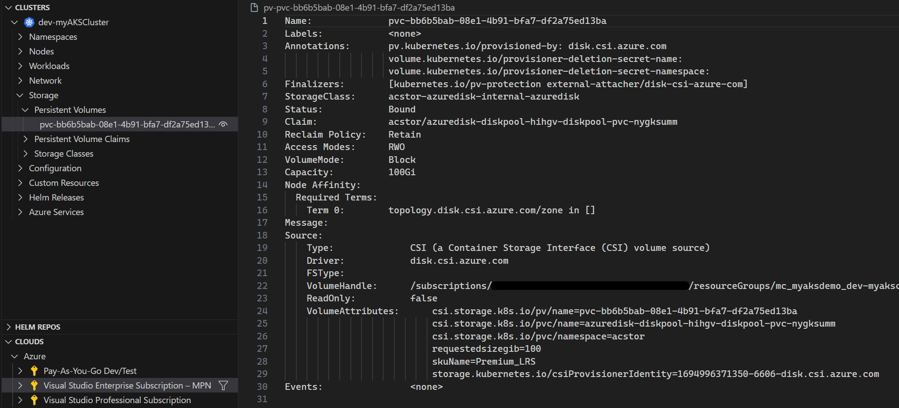
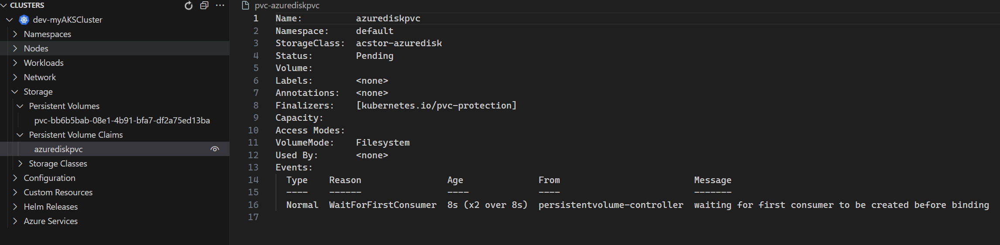
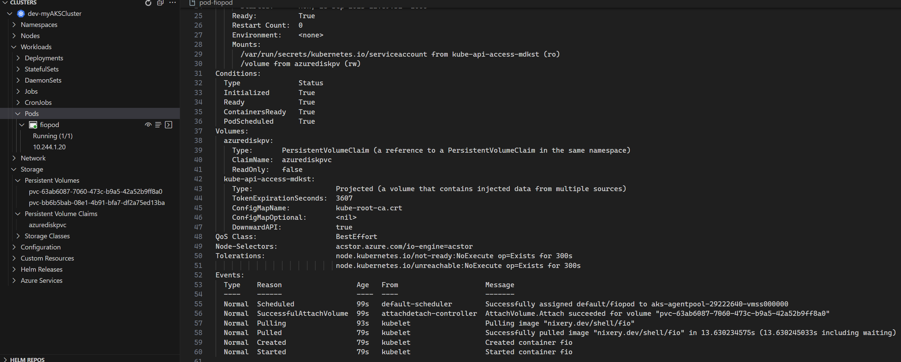
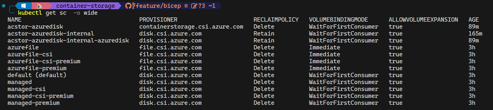
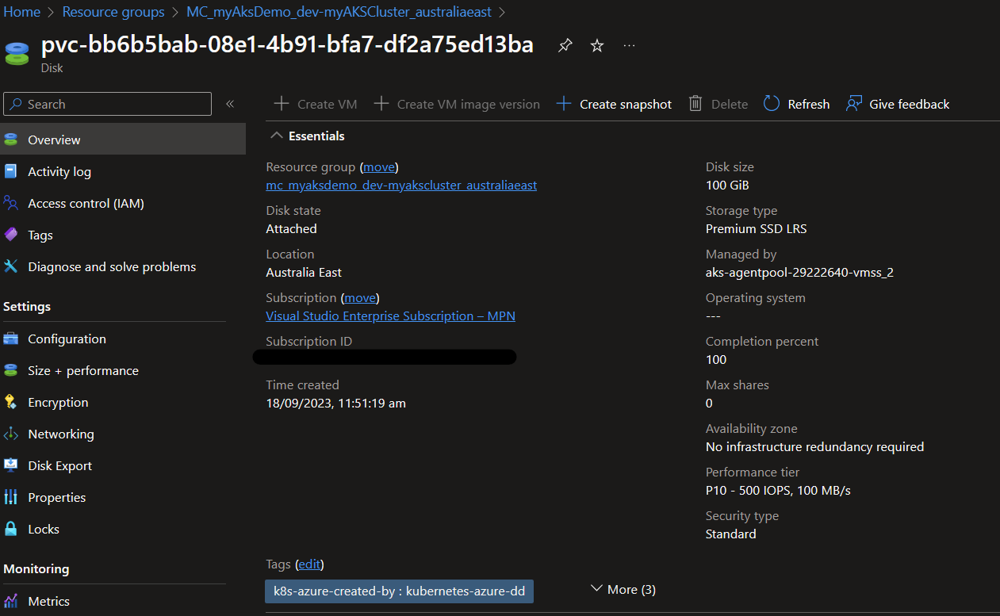

# Azure Container Storage: An Introspective

👋 Hey there, fellow techies! Are you tired of dealing with the headache of managing storage for your container workloads? 😩 Well, fear not! Azure Container Storage is here to save the day! 🦸‍♂️💾

In this blog post, we'll dive into the world of Azure Container Storage and explore how it can make your so much easier. 🤓 We'll cover everything from the basics of container storage and provide the instruction to deploy Azure Container Storage on an AKS cluster.

Let's take a journey through the wonderful world of Azure Container Storage! 🚀

## What is Azure Container Storage?

Azure Container Storage solves the problem of managing storage for container workloads in a scalable, secure, and cost-effective way. It provides a fully managed, cloud-native solution for volume management, deployment, and orchestration for containers, and seamlessly integrates with Kubernetes to enable automatic and dynamic provisioning of persistent volumes. By using Azure Container Storage, developers can focus on building and deploying containerized applications without worrying about the underlying storage infrastructure.

Container Storage is a managed service that provides persistent storage for containerized applications. It supports both block and file storage, and can be used with any container orchestrator that supports the Container Storage Interface (CSI). It is built on top of Azure Storage, which provides a highly available, durable, and scalable storage platform for all types of data.

Container Storage Pools are the basic building blocks of Azure Container Storage. They are logical groupings of storage resources that can be used to provision persistent volumes for containers. Each pool has its own set of storage resources, which can be scaled up or down independently of other pools in the same account. This allows you to easily manage your storage resources based on the needs of your applications.

Read more here: https://learn.microsoft.com/en-us/azure/storage/container-storage/container-storage-introduction

and here: https://techcommunity.microsoft.com/t5/azure-storage-blog/azure-container-storage-in-public-preview/ba-p/3819246

## What are the benefits of using Azure Container Storage?

1. Lowering the total cost of ownership by enabling shared provisioning of capacity and performance on a storage pool, which can be leveraged by multiple volumes.

1. Rapid scale-out of stateful pods using remote network protocols like NVME-oF and iSCSI to mount PV, enabling effortless scaling on AKS across Compute and Storage.

1. Simplified consistent volume management interface backed by local and remote storage options enabling customers to allocate and use storage via the Kubernetes control plane.

1. Fully integrated day-2 experiences, including data protection, cross-cluster recovery, and observability providing operational simplicity for customers who need to create customer scripts or stitch together disparate tools today.

## Supported storage types

Azure Container Storage supports the following storage types:

1. Azure Elastic SAN Preview: This is a highly scalable and performant shared file system that can be used as persistent storage for containerized applications. It provides a fully managed, cloud-native solution for storing and sharing data across multiple containers and pods.

1. Azure Disks: This is a managed disk service that provides high-performance, low-latency storage for virtual machines and container workloads. It supports both standard and premium disk types, with options for encryption and snapshots.

1. Ephemeral Disk: This is a temporary disk that is created and attached to a container when it is scheduled on a node. It provides fast, local storage for temporary data that does not need to be persisted beyond the lifetime of the container.

Each storage option has its own strengths and weaknesses, and the best option for your use case will depend on factors like performance, scalability, cost, and data access patterns.

## Creating the underlying Infrastructure

Before we can start using Azure Container Storage, we need to create the underlying infrastructure. This includes creating a resource group, storage account, and container registry and AKS cluster. We'll use bicep to create these resources. You can find code for this blog in my GitHub repo.

https://github.com/broberts23/container-storage

For simplicity we'll contain the code in a single main.bicep and inject the paramater values from the pipeline. This will allow us to easily change the parameters without having to modify the main file.

```bicep
param location string = resourceGroup().location
param clusterName string
param nodeCount int
param nodeSize string

@description('Create the AKS cluster')
resource aks 'Microsoft.ContainerService/managedClusters@2023-07-02-preview' = {
  name: clusterName
  location: location
  identity: {
    type: 'SystemAssigned'
  }
  properties: {
    dnsPrefix: clusterName
    agentPoolProfiles: [
      {
        name: 'agentpool'
        // the node pool label to associate the node pool with the correct IO engine for Azure Container Storage
        nodeLabels: {
          'acstor.azure.com/io-engine': 'acstor'
        }
        count: nodeCount
        vmSize: nodeSize
        mode: 'System'
      }
    ]
  }
}

output controlPlaneFQDN string = aks.properties.fqdn

```

I'll be deploying the custer and performing the RBAC assignment using GitHub Actions. You'll need to create a service principal and store the credentials in GitHub secrets. You'll also need to create a resource group. The workflow file is below:

You can also find all the code im my GitHub repo.

```yaml
on:
    pull_request: 
  
permissions:
    id-token: write
    contents: read
  
env:
    resource-group: myAksDemo # name of the Azure resource group
    clusterName: dev-myAksCluster-01 # name of the AKS cluster
    nodeCount: 3 # number of nodes in the cluster
    nodeSize: Standard_D4s_v5 # You must choose a VM type that supports Azure premium storage and a minimum of 4 vCPUs.
  
jobs:
    bicep-whatif:
      name: 'Bicep What-If'
      runs-on: ubuntu-latest
      steps:
        - name: Checkout code
          uses: actions/checkout@v3
  
        - name: 'Az CLI login'
          uses: azure/login@v1
          with:
            client-id: ${{ secrets.AZURE_CLIENT_ID }}
            tenant-id: ${{ secrets.AZURE_TENANT_ID }}
            subscription-id: ${{ secrets.AZURE_SUBSCRIPTION_ID }}
        
        - name: Upgrade Az Bicep
          run: az bicep upgrade

        # Run what-if deployment
        - name: What-If
          uses: azure/arm-deploy@v1
          with:
            scope: resourcegroup
            failOnStdErr: false
            resourceGroupName: ${{ env.resource-group }}
            template: main.bicep
            parameters: 'clusterName=${{ env.clusterName }} nodeCount=${{ env.nodeCount }} nodeSize=${{ env.nodeSize }}'
            additionalArguments: --what-if
  
    bicep-deploy:
      name: 'Bicep Deploy'
      environment: dev
      runs-on: ubuntu-latest
      needs: [bicep-whatif]
      
      steps:
        # Checkout the repository to the GitHub Actions runner
        - name: Checkout
          uses: actions/checkout@v3
  
        # Authenticate to Az CLI using OIDC
        - name: 'Az CLI login'
          uses: azure/login@v1
          with:
            client-id: ${{ secrets.AZURE_CLIENT_ID }}
            tenant-id: ${{ secrets.AZURE_TENANT_ID }}
            subscription-id: ${{ secrets.AZURE_SUBSCRIPTION_ID }}

        - name: Upgrade Az Bicep
          run: az bicep upgrade

        # Deploy
        - name: Deploy
          uses: azure/arm-deploy@v1
          with:
            scope: resourcegroup
            failOnStdErr: false
            resourceGroupName: ${{ env.resource-group }}
            template: main.bicep
            parameters: 'clusterName=${{ env.clusterName }} nodeCount=${{ env.nodeCount }} nodeSize=${{ env.nodeSize }}'

        # Assign the default AKS managed identity the role of Contributor on the managed resource group
        - name: RBAC Assignment
          uses: azure/cli@v1
          with:
            inlineScript: |
              export AKS_MI_OBJECT_ID=$(az aks show --name ${{ env.clusterName }} --resource-group ${{ env.resource-group }} --query "identityProfile.kubeletidentity.objectId" -o tsv) 
              export AKS_NODE_RG=$(az aks show --name ${{ env.clusterName }} --resource-group ${{ env.resource-group }} --query "nodeResourceGroup" -o tsv)
              az role assignment create --assignee $AKS_MI_OBJECT_ID --role "Contributor" --resource-group "$AKS_NODE_RG"
  ```

To use Azure Container Storage with Azure managed disks, your AKS cluster should have a node pool of at least three general purpose VMs such as standard_d4s_v5 for the cluster nodes, each with a minimum of four virtual CPUs (vCPUs).

## Connecting to the AKS cluster

After the cluster has been deployed, we need to connect to it to install Azure Container Storage. Instead of using Azure CLI and kubectl, we'll use the Kubernetes extension for VS Code. This extension allows us to easily connect to an AKS cluster and run commands against it from within VS Code.

Find your new cluster under the CLOUD pane in VS Code and right click on it. Select "Merge into KubeConfig" from the context menu. Then refresh the top CLUSTERS pane if your cluster is not automatically selected.



After connecting to the cluster the mode important thing to validate is the label `acstor.azure.com/io-engine=acstor` has been added to the nodes



## Installing Azure Container Storage

Replace <cluster-name> and <resource-group> with your own values. The <name> value can be whatever you want; it's just a label for the extension you're installing.

```bash
az k8s-extension create --cluster-type managedClusters --cluster-name <cluster name> --resource-group <resource group name> --name <name of extension> --extension-type microsoft.azurecontainerstorage --scope cluster --release-train stable --release-namespace acstor
```

If prompted to install k8s-extension extension, select Y.
If the recieve a warning that 'Microsoft.KubernetesConfiguration' provider has not been registered, use the following command to register it:

```bash
az provider register --namespace Microsoft.Kubernetes
az provider register --namespace Microsoft.KubernetesConfiguration
az provider register --namespace Microsoft.ExtendedLocation
```

The installation takes 10-15 minutes to complete

Review the JSON response and verify the "provisioningState" is "Succeeded".



You can also also verify the extension has been installed by running the following command:

```bash
kubectl get sc  -o wide
```



acstor-azure-disk is the default storage class for Azure Container Storage.

## Creating a storage pool

Now that we have Azure Container Storage installed, we can create a storage pool. A storage pool is a logical grouping of storage resources that can be used to provision persistent volumes for containers. Each pool has its own set of storage resources, which can be scaled up or down independently of other pools in the same account. This allows you to easily manage your storage resources based on the needs of your applications.

We'll create a storage pool using the following YAML manifest and use kubectl to apply it to the cluster:

```yaml
apiVersion: containerstorage.azure.com/v1alpha1
kind: StoragePool
metadata:
  name: azuredisk
  namespace: acstor
spec:
  poolType:
    azureDisk: {}
  resources:
    requests: {"storage": 100Gi}
```

Let's take a look at the PVC that was created:



## Creating a persistent volume claim

Now that we have a storage pool, we can create a persistent volume claim (PVC) to use it. A PVC is a request for storage that can be used by a container. It is similar to a pod, but it does not have any containers running inside it. Instead, it is used as a storage resource for other pods.

Create a PVC using the following YAML manifest and use kubectl to apply it to the cluster:

```yaml
apiVersion: v1
kind: PersistentVolumeClaim
metadata:
  name: azurediskpvc
spec:
  accessModes:
    - ReadWriteOnce
  storageClassName: acstor-azuredisk # replace with the name of your storage class if different
  resources:
    requests:
      storage: 10Gi
```



Looking good! 😎

Finally, let's create a pod that uses the PVC we just created. We'll use the following YAML manifest and use kubectl to apply it to the cluster:

```yaml
kind: Pod
apiVersion: v1
metadata:
  name: fiopod
spec:
  nodeSelector:
    acstor.azure.com/io-engine: acstor
  volumes:
    - name: azurediskpv
      persistentVolumeClaim:
        claimName: azurediskpvc
  containers:
    - name: fio
      image: nixery.dev/shell/fio
      args:
        - sleep
        - "1000000"
      volumeMounts:
        - mountPath: "/volume"
          name: azurediskpv
```

Fio (Flexible I/O Tester) is a benchmarking and workload simulation. It supports many different types of I/O engines, including asynchronous I/O, mmap, and POSIX AIO. It also supports multiple threads and multiple files per thread.



Beautiful! 😍



We can also see the disk in the Azure portal under the cluster managed resource group:



## Conclusion

Azure Container Storage is a great solution for managing storage for container workloads. It provides a fully managed, cloud-native solution that integrates seamlessly with Kubernetes to enable automatic and dynamic provisioning of persistent volumes. By using Azure Container Storage, developers can focus on building and deploying containerized applications without worrying about the underlying storage infrastructure.

I hope you found this blog post helpful! If you have any questions or feedback, please feel free to leave a comment below. I'd love to hear from you! 😊